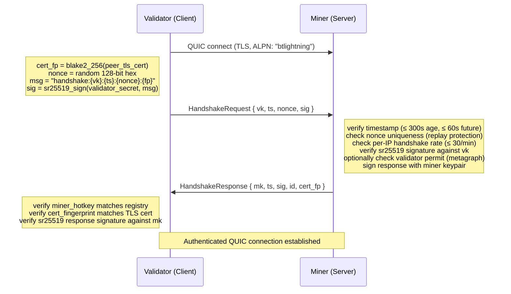
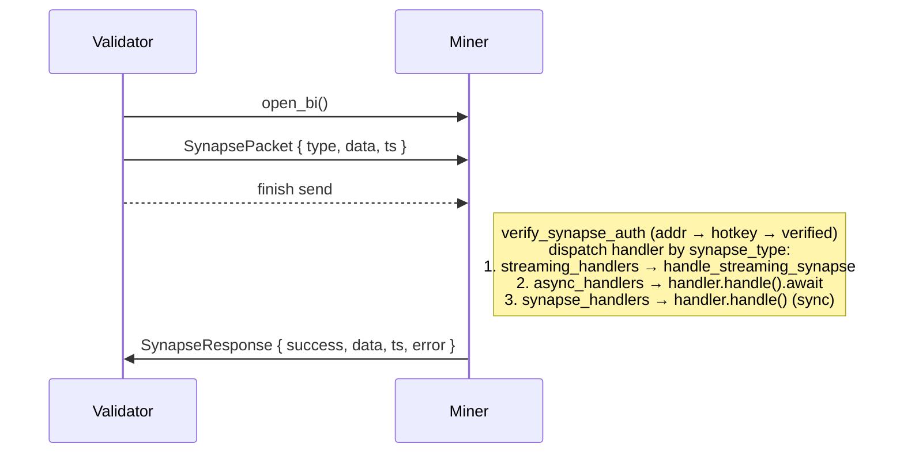
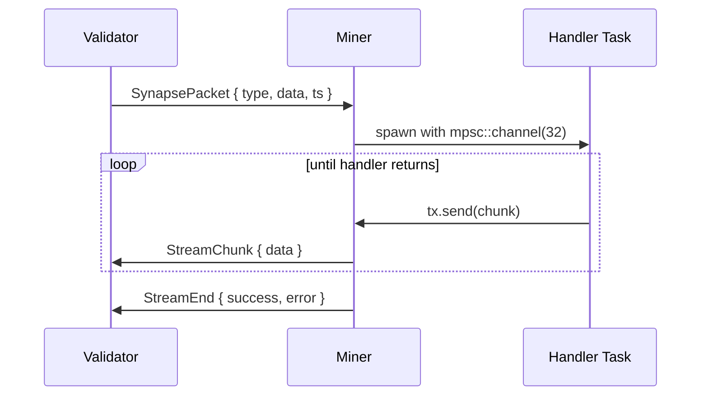

# Architecture

btlightning is a QUIC-based transport layer for the Bittensor network. It replaces HTTP-based synapse communication between validators and miners with persistent, multiplexed QUIC connections authenticated via sr25519 signatures.

## Repository Structure

```
lightning/
├── crates/
│   ├── btlightning/          Core Rust library
│   │   ├── src/
│   │   │   ├── lib.rs         Re-exports public API
│   │   │   ├── client.rs      LightningClient, connection pooling, reconnection
│   │   │   ├── server.rs      LightningServer, handler dispatch, rate limiting
│   │   │   ├── types.rs       Wire protocol types, framing, NamedSerializer
│   │   │   ├── signing.rs     Signer trait, Sr25519Signer, CallbackSigner, BtWalletSigner
│   │   │   ├── error.rs       LightningError enum
│   │   │   └── util.rs        Timestamp helpers
│   │   └── fuzz/              Fuzz targets (excluded from workspace)
│   └── btlightning-py/        PyO3 bindings (cdylib)
│       └── src/
│           ├── lib.rs          RustLightning, RustLightningServer, PyStreamingResponse
│           ├── handler.rs      Python callable → SynapseHandler bridge
│           ├── signer.rs       Python callable → Signer bridge, PythonPermitResolver
│           └── types.rs        PyQuicAxonInfo
└── benchmarks/                 Latency/throughput benchmarks (echo handler)
```

## Wire Protocol

All messages use a 5-byte framed envelope over QUIC bidirectional streams.

### Frame Format

```
[ msg_type: 1 byte | payload_len: 4 bytes big-endian | payload: variable ≤ 64 MiB ]
```

Payloads are MessagePack-encoded. The `NamedSerializer` (a custom `serde::Serializer`) ensures struct fields serialize as named map keys rather than positional indices, which is critical for cross-language compatibility.

### Message Types

| Byte | Type | Direction | Purpose |
|------|------|-----------|---------|
| `0x01` | `HandshakeRequest` | client → server | Initiate authentication |
| `0x02` | `HandshakeResponse` | server → client | Authentication result |
| `0x03` | `SynapsePacket` | client → server | Request payload |
| `0x04` | `SynapseResponse` | server → client | Unary response |
| `0x05` | `StreamChunk` | server → client | Streaming response fragment |
| `0x06` | `StreamEnd` | server → client | Terminal streaming frame |

### Large Payload Handling

Payloads ≤ 1 MiB are read in a single allocation. Payloads > 1 MiB are read incrementally in 64 KiB chunks with a doubling-capacity strategy, hard-capped at 64 MiB (`MAX_FRAME_PAYLOAD`).

## Authentication Protocol

Authentication operates entirely at the application layer. TLS provides transport encryption only — certificate validation is intentionally bypassed (`AcceptAnyCertVerifier`) because Bittensor nodes use self-signed certificates and identity is established through substrate sr25519 keypairs, not a PKI hierarchy.

The TLS certificate fingerprint is still cryptographically bound into the handshake signatures, preventing MITM attacks where an attacker could terminate TLS and re-establish a separate connection to the real peer.

### Handshake Sequence



Both sides sign over a message that includes the TLS certificate fingerprint, binding the application-layer identity to the transport-layer session. The signed message format uses colon-delimited fields:

- Request: `handshake:{validator_hotkey}:{timestamp}:{nonce}:{cert_fp_b64}`
- Response: `handshake_response:{validator_hotkey}:{miner_hotkey}:{timestamp}:{nonce}:{cert_fp_b64}`

### Replay Protection

The server maintains a `HashMap<String, u64>` of used nonces (nonce → timestamp). Duplicate nonces are rejected. Cleanup runs on a configurable interval (default 60s), evicting nonces older than `max_signature_age_secs`. If the nonce table exceeds `max_nonce_entries` (default 100,000), it is sorted by timestamp and truncated to retain only the newest entries.

### Validator Permit Gating

When `require_validator_permit` is enabled, the server resolves permitted validators through the `ValidatorPermitResolver` trait (typically backed by a Bittensor metagraph query). The permitted set is cached and refreshed on a background task every `validator_permit_refresh_secs` (default 1800s). Validators not in the cached set are rejected at handshake.

## Transport Layer

### QUIC Configuration

Both client and server use [quinn](https://github.com/quinn-rs/quinn) with [rustls](https://github.com/rustls/rustls).

| Parameter | Client Default | Server Default |
|-----------|---------------|----------------|
| Idle timeout | 150s | 150s |
| Keep-alive interval | 30s | 30s |
| Max concurrent bidi streams | quinn default | 128 |
| Max concurrent uni streams | quinn default | 0 |
| ALPN | `btlightning` | `btlightning` |
| Client auth | none | none |
| Cert validation | disabled | n/a (self-signed) |

The server generates a self-signed certificate on each `start()` call using `rcgen` with `"localhost"` as the SAN. The DER-encoded certificate's `blake2_256` hash serves as the fingerprint used in the handshake.

### Why PKI Is Bypassed

Bittensor miners are identified by sr25519 hotkeys registered on the subtensor chain, not by domain names or CA-issued certificates. Requiring valid TLS certificates would add infrastructure burden with no security benefit, since the trust anchor is the chain's metagraph, not a certificate authority. The application-layer handshake provides mutual authentication that is strictly stronger than TLS client certs for this use case, because it binds identity to on-chain registration.

## Connection Model

### Client Side

`LightningClient` maintains a two-layer connection pool that separates identity (hotkey) from transport (ip:port). Multiple metagraph entries (different hotkeys) can register the same ip:port — for example, when multiple miners run on the same machine, or when an adversary claims a legitimate miner's address. Each hotkey is independently authenticated via handshake to prove the server actually controls the claimed identity.

```
ClientState
├── active_miners:            HashMap<hotkey, QuicAxonInfo>
├── established_connections:  HashMap<"ip:port", quinn::Connection>
└── reconnect_states:         HashMap<"ip:port", ReconnectState>
```

`active_miners` is keyed by hotkey (the unique on-chain identity), while `established_connections` and `reconnect_states` are keyed by `"ip:port"` (the network address). This means multiple authenticated hotkeys can share a single QUIC connection when they point to the same address.

During `initialize_connections`, miners are grouped by address. One QUIC connection is established per unique ip:port, then each hotkey at that address is independently authenticated via `authenticate_handshake`. Only hotkeys whose handshake succeeds (server signs with matching keypair) are registered in `active_miners`. If no hotkeys authenticate at an address, the connection is closed.

Connection liveness is checked lazily on each query via `conn.close_reason().is_none()`. Dead connections trigger reconnection with exponential backoff (1s initial, 2x growth, 60s cap, 5 retries max). The backoff state resets on successful reconnect or when `update_miner_registry` includes the miner.

`update_miner_registry` performs full reconciliation: deregisters absent hotkeys, closing the underlying QUIC connection only when no remaining hotkeys reference that address. New hotkeys at already-connected addresses are authenticated on the existing connection without establishing a new one. The `max_connections` cap (default 1024) counts unique QUIC connections, not hotkeys.

### Server Side

`LightningServer` tracks connections through two synchronized indices:

```
ServerContext
├── connections:     HashMap<hotkey, ValidatorConnection>
└── addr_to_hotkey:  HashMap<SocketAddr, hotkey>
```

On reconnect from the same hotkey, the old connection is explicitly closed with reason `b"replaced"` and its address entry is cleaned up before inserting the new one. Cleanup on disconnect uses `Arc::ptr_eq` to avoid accidentally removing a replacement connection that was established between the disconnect and the cleanup.

Background tasks run alongside `serve_forever`:
- **Nonce cleanup**: evicts expired nonces and stale rate-limit entries (interval: `nonce_cleanup_interval_secs`)
- **Permit refresh**: re-resolves the permitted validator set via `ValidatorPermitResolver` (interval: `validator_permit_refresh_secs`)

## Request/Response Flow

Once authenticated, each synapse exchange uses a fresh bidirectional QUIC stream on the existing connection.

### Unary Request



Handler dispatch priority: streaming handlers are checked first (by synapse_type name), then async handlers, then sync handlers. If no handler matches, the server returns `success: false` with `"unrecognized synapse type"`.

### Streaming Response



The handler runs in a spawned task and writes chunks through a bounded `mpsc::channel` (capacity 32). The server's main task drains the channel, framing each `Vec<u8>` as a `StreamChunk`. When the handler returns, a `StreamEnd` frame is sent. The client's `StreamingResponse` exposes this as an iterator via `next_chunk()`, with `collect_all()` available for buffered consumption (guarded by `MAX_RESPONSE_SIZE`).

### Typed Handler Wrappers

`typed_handler` and `typed_async_handler` provide ergonomic registration of handlers that work with concrete Rust types instead of raw `HashMap<String, rmpv::Value>`. They deserialize the request via `rmpv::ext::from_value` and serialize the response via `serialize_to_rmpv_map`, wrapping the user's closure in a `SynapseHandler` or `AsyncSynapseHandler` impl.

## Rate Limiting

Rate limiting applies only to the handshake phase, not to synapse requests on authenticated connections.

**Per-IP handshake rate**: tracked as `HashMap<IpAddr, Vec<u64>>` (timestamps of recent attempts). Within a 60-second sliding window, a maximum of `max_handshake_attempts_per_minute` (default 30) handshakes are allowed per IP. When the tracking table reaches `max_tracked_rate_ips` (default 10,000), the least-recently-active IP is evicted before inserting a new one.

Post-authentication, the only concurrency control is QUIC's `max_concurrent_bidi_streams` (default 128 per connection).

## Python Bindings

The `btlightning-py` crate produces a `cdylib` Python extension module via PyO3. It bridges the async Rust core to Python's synchronous calling convention.

Each `RustLightning` (client) and `RustLightningServer` instance owns a dedicated `tokio::Runtime`. Python calls use `py.detach(|| runtime.block_on(...))` to release the GIL while blocking on async operations.

Key bridging concerns:

| Rust | Python |
|------|--------|
| `HashMap<String, rmpv::Value>` | `dict` (recursive conversion via `msgpack_value_to_py` / `py_to_msgpack_value`) |
| `StreamingResponse` | `PyStreamingResponse` implementing `__iter__` / `__next__`, yielding `bytes` |
| `dyn Signer` | `PythonSigner` wrapping a Python callable |
| `dyn ValidatorPermitResolver` | `PythonPermitResolver` wrapping a Python callable |
| `dyn SynapseHandler` | `PythonSynapseHandler` wrapping a Python callable |
| `dyn StreamingSynapseHandler` | `PythonStreamingSynapseHandler` wrapping a Python callable |
| `LightningError` variants | Mapped to `PyConnectionError`, `PyValueError`, or `PyRuntimeError` |

The `btwallet` feature is always enabled in the Python build, providing `set_wallet` / `set_miner_wallet` methods that load hotkeys directly from Bittensor wallet files on disk.

## Serialization

MessagePack is the wire format, using `rmp-serde` for encode/decode and `rmpv` for the dynamic value type.

The custom `NamedSerializer` exists because `rmp-serde`'s default struct serialization uses integer-indexed arrays, which breaks cross-language deserialization (Python, JavaScript) where field access is by name. `NamedSerializer` forces all struct fields to serialize as string-keyed maps, ensuring `{"synapse_type": "Foo", "data": {...}}` rather than `["Foo", {...}]`.

Exposed through the public `serialize_to_rmpv_map<T: Serialize>` function, which is also used internally by the typed handler wrappers.

## Error Model

All fallible operations return `Result<T, LightningError>`. The error enum has eight variants that map to distinct failure domains:

| Variant | Domain |
|---------|--------|
| `Connection` | QUIC connection establishment, endpoint binding |
| `Handshake` | Authentication failures, signature verification |
| `Signing` | Keypair operations, signer callback errors |
| `Serialization` | MessagePack encode/decode failures |
| `Transport` | Frame read/write, unexpected message types |
| `Handler` | User handler returned an error |
| `Config` | Invalid configuration, wallet loading |
| `Stream` | Streaming protocol violations, size limits |

Connection and handshake failures during batch operations (`initialize_connections`, `update_miner_registry`) are logged and skipped rather than propagated, allowing partial success when connecting to multiple miners.

## Key Dependencies

| Crate | Role |
|-------|------|
| `quinn` 0.11 | QUIC transport (streams, connections, endpoints) |
| `rustls` 0.23 | TLS for QUIC (ring crypto backend) |
| `rcgen` 0.13 | Self-signed certificate generation |
| `sp-core` 34.0 | Sr25519 keypair/signing (Substrate cryptography) |
| `rmp-serde` / `rmpv` | MessagePack serialization |
| `tokio` 1.0 | Async runtime |
| `pyo3` 0.26 | Python extension module (btlightning-py only) |
| `bittensor_wallet` | Wallet file hotkey loading (optional, `btwallet` feature) |
