<div align="center">
    <h2>Ligh𝞽ning</h2>
    <p><strong>Rust QUIC transport layer for Bittensor</strong></p>
    <p>Persistent QUIC connections with sr25519 handshake authentication for validator-miner communication.</p>
</div>

## Performance

Benchmarked on Apple Silicon (M-series), macOS, loopback networking. Echo handler returns input unchanged. Source: [`benchmarks/`](benchmarks/).

| | bittensor (dendrite/axon) | lightning |
|---|---|---|
| Protocol | HTTP/1.1 | QUIC |
| Serialization | JSON | MessagePack |
| Transport encryption | None | TLS 1.3 |
| Auth model | Per-request | Per-connection |

| Metric | bittensor | lightning |
|---|---|---|
| Connection setup (p50) | 102.95 ms | 0.65 ms |
| Latency p50 (1KB) | 175.24 ms | 0.05 ms |
| Latency p99 (1KB) | 295.36 ms | 0.07 ms |
| Throughput (1KB) | 61 req/s | 67,210 req/s |
| Wire size (1KB payload) | 2,052 bytes | 1,052 bytes |

**Legend:** <svg width="12" height="12"><rect width="12" height="12" fill="#808080"/></svg> bittensor &nbsp; <svg width="12" height="12"><rect width="12" height="12" fill="#FFE000"/></svg> lightning

### Latency p50 (ms)

```mermaid
---
config:
    xyChart:
        plotReservedSpacePercent: 60
    themeVariables:
        xyChart:
            backgroundColor: "#000000"
            plotColorPalette: "#808080, #FFE000"
            titleColor: "#ffffff"
            xAxisLabelColor: "#aaaaaa"
            xAxisTitleColor: "#cccccc"
            xAxisTickColor: "#666666"
            xAxisLineColor: "#444444"
            yAxisLabelColor: "#aaaaaa"
            yAxisTitleColor: "#cccccc"
            yAxisTickColor: "#666666"
            yAxisLineColor: "#444444"
---
xychart-beta
    x-axis ["256B", "1KB", "10KB", "100KB", "1MB"]
    y-axis "ms" 0 --> 300
    bar "bittensor" [196.09, 175.24, 30.31, 123.06, 227.43]
    bar "lightning" [0.05, 0.05, 0.11, 0.71, 7.71]
```



### Throughput (req/s)



<details>
<summary>Full results (all payload sizes)</summary>

```mermaid
---
config:
    xyChart:
        plotReservedSpacePercent: 60
    themeVariables:
        xyChart:
            backgroundColor: "#000000"
            plotColorPalette: "#808080, #FFE000"
            titleColor: "#ffffff"
            xAxisLabelColor: "#aaaaaa"
            xAxisTitleColor: "#cccccc"
            xAxisTickColor: "#666666"
            xAxisLineColor: "#444444"
            yAxisLabelColor: "#aaaaaa"
            yAxisTitleColor: "#cccccc"
            yAxisTickColor: "#666666"
            yAxisLineColor: "#444444"
---
xychart-beta
    x-axis ["256B", "1KB", "10KB", "100KB", "1MB"]
    y-axis "req/s" 0 --> 100000
    bar "bittensor" [49, 61, 60, 59, 57]
    bar "lightning" [90126, 67210, 18576, 1958, 193]
```

### Latency (ms)

| Payload | bittensor p50 | p95 | p99 | lightning p50 | p95 | p99 |
|---|---|---|---|---|---|---|
| 256B | 196.09 | 250.05 | 283.00 | 0.05 | 0.10 | 0.11 |
| 1KB | 175.24 | 250.13 | 295.36 | 0.05 | 0.06 | 0.07 |
| 10KB | 30.31 | 225.01 | 273.88 | 0.11 | 0.13 | 0.13 |
| 100KB | 123.06 | 156.30 | 176.01 | 0.71 | 0.85 | 1.20 |
| 1MB | 227.43 | 289.27 | 317.42 | 7.71 | 8.62 | 13.56 |

### Throughput (req/s)

| Payload | bittensor | lightning |
|---|---|---|
| 256B | 49 | 90,126 |
| 1KB | 61 | 67,210 |
| 10KB | 60 | 18,576 |
| 100KB | 59 | 1,958 |
| 1MB | 57 | 193 |

### Wire overhead (bytes)

| Payload | bittensor | lightning |
|---|---|---|
| 256B | 1,028 | 284 |
| 1KB | 2,052 | 1,052 |
| 10KB | 14,341 | 10,268 |
| 100KB | 137,222 | 102,430 |
| 1MB | 1,398,791 | 1,048,606 |

</details>

## Python

```bash
pip install btlightning
```

```python
from btlightning import Lightning

client = Lightning(wallet_hotkey="5GrwvaEF...")
client.set_python_signer(my_signer_callback)
client.initialize_connections([
    {"hotkey": "5FHneW46...", "ip": "192.168.1.1", "port": 8443}
])
response = client.query_axon(
    {"hotkey": "5FHneW46...", "ip": "192.168.1.1", "port": 8443},
    {"synapse_type": "MyQuery", "data": {"key": "value"}}
)
```

## Rust

```toml
[dependencies]
btlightning = "0.1"
```

```rust
use btlightning::{LightningClient, Sr25519Signer, QuicAxonInfo, QuicRequest};

let mut client = LightningClient::new("5GrwvaEF...".into());
client.set_signer(Box::new(Sr25519Signer::from_seed(seed)));
client.initialize_connections(vec![
    QuicAxonInfo::new("5FHneW46...".into(), "192.168.1.1".into(), 8443, 4, 0, 0)
]).await?;
```

## Build from source

```bash
cargo build -p btlightning
maturin develop --manifest-path crates/btlightning-py/Cargo.toml
```
