<div align="center">
    <h2>Ligh𝞽ning</h2>
    <p><strong>Rust QUIC transport layer for Bittensor</strong></p>
    <p>Persistent QUIC connections with sr25519 handshake authentication for validator-miner communication.</p>
</div>

## Python

```bash
pip install btlightning
```

```python
from btlightning import Lightning

client = Lightning(wallet_hotkey="5GrwvaEF...")
client.set_python_signer(my_signer_callback)
client.initialize_connections([
    {"hotkey": "5FHneW46...", "ip": "192.168.1.1", "port": 8443}
])
response = client.query_axon(
    {"hotkey": "5FHneW46...", "ip": "192.168.1.1", "port": 8443},
    {"synapse_type": "MyQuery", "data": {"key": "value"}}
)
```

## Rust

```toml
[dependencies]
btlightning = "0.1"
```

```rust
use btlightning::{LightningClient, Sr25519Signer, QuicAxonInfo, QuicRequest};

let mut client = LightningClient::new("5GrwvaEF...".into());
client.set_signer(Box::new(Sr25519Signer::from_seed(seed)));
client.initialize_connections(vec![
    QuicAxonInfo::new("5FHneW46...".into(), "192.168.1.1".into(), 8443, 4, 0, 0)
]).await?;
```

## Build from source

```bash
cargo build -p btlightning
maturin develop --manifest-path crates/btlightning-py/Cargo.toml
```

## Performance

Benchmarked on Apple Silicon (M-series), macOS, loopback networking. Echo handler returns input unchanged. Connection setup includes first request-response round trip. Bittensor payloads are base64-encoded (JSON has no binary type), adding ~33% wire overhead beyond the nominal payload size. Source: [`benchmarks/`](benchmarks/).

| | bittensor (dendrite/axon) | lightning (Python) | lightning (Rust) |
|---|---|---|---|
| Protocol | HTTP/1.1 | QUIC | QUIC |
| Serialization | JSON | MessagePack | MessagePack |
| Transport encryption | None | TLS 1.3 | TLS 1.3 |
| Auth model | Per-request | Per-connection | Per-connection |

| Metric | bittensor | lightning (Python) | lightning (Rust) |
|---|---|---|---|
| Connection setup (p50) | 114.46 ms | 2.68 ms | 0.71 ms |
| Latency p50 (1KB) | 24.01 ms | 0.08 ms | 0.05 ms |
| Latency p99 (1KB) | 28.80 ms | 0.09 ms | 0.07 ms |
| Throughput (1KB) | 41 req/s | 26,539 req/s | 68,650 req/s |
| Wire size (1KB payload) | 2,032 bytes | 1,052 bytes | 1,052 bytes |

| Color | System |
|---|---|
|  | bittensor |
|  | lightning (Python) |
|  | lightning (Rust) |

### Latency p50

```mermaid
---
config:
    xyChart:
        plotReservedSpacePercent: 60
    themeVariables:
        xyChart:
            backgroundColor: "#000000"
            plotColorPalette: "#808080, #FF8C00, #FFE000"
            titleColor: "#ffffff"
            xAxisLabelColor: "#aaaaaa"
            xAxisTitleColor: "#cccccc"
            xAxisTickColor: "#666666"
            xAxisLineColor: "#444444"
            yAxisLabelColor: "#aaaaaa"
            yAxisTitleColor: "#cccccc"
            yAxisTickColor: "#666666"
            yAxisLineColor: "#444444"
---
xychart-beta
    x-axis ["256B", "1KB", "10KB", "100KB", "1MB"]
    y-axis "log10(us)" 0 --> 5
    bar "bittensor" [4.39, 4.38, 4.39, 4.42, 4.61]
    bar "lightning (Python)" [1.90, 1.90, 2.36, 3.27, 4.31]
    bar "lightning (Rust)" [1.70, 1.70, 2.04, 2.84, 3.87]
```



### Throughput (req/s)

```mermaid
---
config:
    xyChart:
        plotReservedSpacePercent: 60
    themeVariables:
        xyChart:
            backgroundColor: "#000000"
            plotColorPalette: "#808080, #FF8C00, #FFE000"
            titleColor: "#ffffff"
            xAxisLabelColor: "#aaaaaa"
            xAxisTitleColor: "#cccccc"
            xAxisTickColor: "#666666"
            xAxisLineColor: "#444444"
            yAxisLabelColor: "#aaaaaa"
            yAxisTitleColor: "#cccccc"
            yAxisTickColor: "#666666"
            yAxisLineColor: "#444444"
---
xychart-beta
    x-axis ["256B", "1KB", "10KB", "100KB", "1MB"]
    y-axis "log10(req/s)" 0 --> 5
    bar "bittensor" [1.61, 1.61, 1.60, 1.57, 1.40]
    bar "lightning (Python)" [4.55, 4.42, 3.83, 2.94, 1.94]
    bar "lightning (Rust)" [4.92, 4.84, 4.27, 3.26, 2.26]
```



<details>
<summary>Full results (all payload sizes)</summary>

#### Latency (ms)

| Payload | bittensor p50 | p95 | p99 | lightning-py p50 | p95 | p99 | lightning p50 | p95 | p99 |
|---|---|---|---|---|---|---|---|---|---|
| 256B | 24.50 | 28.04 | 35.05 | 0.08 | 0.19 | 0.23 | 0.05 | 0.06 | 0.07 |
| 1KB | 24.01 | 25.57 | 28.80 | 0.08 | 0.09 | 0.09 | 0.05 | 0.06 | 0.07 |
| 10KB | 24.70 | 25.70 | 26.59 | 0.23 | 0.24 | 0.26 | 0.11 | 0.12 | 0.13 |
| 100KB | 26.13 | 27.31 | 29.42 | 1.88 | 2.25 | 2.37 | 0.69 | 0.73 | 0.75 |
| 1MB | 40.72 | 43.11 | 48.00 | 20.55 | 22.48 | 23.31 | 7.40 | 12.36 | 17.02 |

#### Throughput (req/s)

| Payload | bittensor | lightning (Python) | lightning (Rust) |
|---|---|---|---|
| 256B | 41 | 35,181 | 83,460 |
| 1KB | 41 | 26,539 | 68,650 |
| 10KB | 40 | 6,729 | 18,686 |
| 100KB | 38 | 875 | 1,819 |
| 1MB | 25 | 88 | 181 |

#### Wire overhead (bytes)

| Payload | bittensor | lightning |
|---|---|---|
| 256B | 1,008 | 284 |
| 1KB | 2,032 | 1,052 |
| 10KB | 14,321 | 10,268 |
| 100KB | 137,202 | 102,430 |
| 1MB | 1,398,771 | 1,048,606 |

</details>
